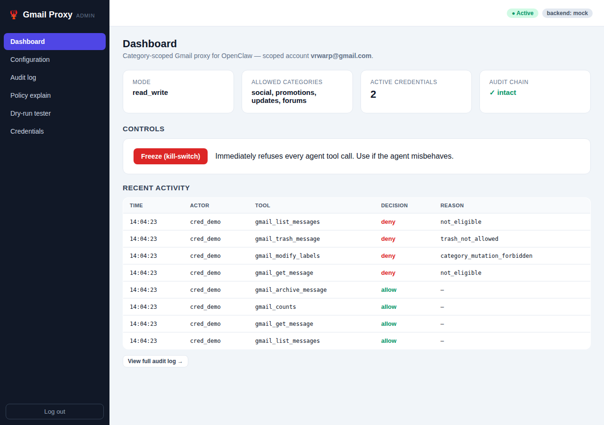

# OpenClaw Gmail Proxy

[](https://github.com/vrwarp/openclaw-gmail-proxy/actions/workflows/ci.yml)
[](https://github.com/vrwarp/openclaw-gmail-proxy/actions/workflows/docker.yml)

A **category-scoped Gmail proxy** for [OpenClaw](https://openclaw.ai/). Give an
autonomous OpenClaw agent access to **only** the parts of your mailbox you
choose — specific Gmail categories (Promotions, Social, Updates, Forums,
Primary), specific labels, or both, with a blocklist that overrides everything —
and nothing else. The proxy holds your real Gmail OAuth token; the agent only
ever sees a narrow, audited tool surface over MCP.

> **Why a proxy?** Gmail's OAuth scopes are **account-wide** — there is *no*
> scope that limits access to a category or label. So the only place scoping can
> be enforced is a trusted layer between the agent and Gmail. That is this proxy.
> See [`DESIGN.md`](DESIGN.md) for the full rationale and threat model.



## How it fits together

```
┌── VM (untrusted) ─────────┐        ┌── Docker host (trusted) ──────────────┐
│ OpenClaw agent            │  MCP    │ gmail-proxy container                 │
│  + "gmail-categories"     │ stream- │  • holds Gmail OAuth token (encrypted)│
│    skill                  │ http +  │  • POLICY ENGINE (scope sandbox)      │──► Gmail API
│  • sees only proxy tools  │ bearer  │  • audit log + kill switch            │
│                           │  auth   │  • admin web UI (localhost only)      │
└───────────────────────────┘         └───────────────────────────────────────┘
```

- **Two pieces:** (1) the proxy server (this repo, runs in Docker outside the
  VM), and (2) the OpenClaw side — an MCP-server registration plus a `SKILL.md`
  (see [`openclaw-plugin/`](openclaw-plugin/)).
- **Enforcement lives in the proxy**, because OpenClaw is untrusted: it reads
  attacker-controlled email and can be prompt-injected. The agent-side
  `tools.allow` is only defense-in-depth.

## What the agent can and cannot do

**Can:** list/search/read messages in scope, mark read/unread, star, archive
(remove from inbox), apply user labels, trash (if you enable it), get unread
counts.

**Cannot (by construction):** read anything out of scope, send/reply/forward,
create drafts, permanently delete, add/remove `CATEGORY_*`/`SPAM`/`TRASH` labels,
change settings, or ever touch the OAuth token.

The MCP tools: `gmail_list_messages`, `gmail_get_message`, `gmail_get_thread`,
`gmail_modify_labels`, `gmail_archive_message`, `gmail_trash_message`,
`gmail_list_labels`, `gmail_counts`, `gmail_get_profile`.

## Scoping

Scope is defined in `policy.yaml` (and editable live in the admin UI):

```yaml
allowed_categories: [promotions, social]   # any of primary/social/promotions/updates/forums
allowed_labels: [Newsletters]              # user labels that also grant access
blocked_labels: [Private]                  # deny — supersedes both allowlists
```

A message is in scope if it matches an allowed category **or** an allowed label —
**unless** it carries a blocked label (which always wins). Labels used for
scoping are made immutable to the agent so it can't relabel messages into or out
of scope.

## Quick start — local demo (no Google account needed)

```bash
python -m venv .venv && . .venv/bin/activate
pip install -e .
ADMIN_TOKEN=demo GMAIL_BACKEND=mock gmail-proxy
```

- Admin UI: <http://127.0.0.1:8081/> (log in with `demo`)
- MCP endpoint: `http://127.0.0.1:8443/mcp`

Issue an agent token on the **Credentials** page, then point an MCP client at
the endpoint with `Authorization: Bearer <token>`.

## Production (real Gmail)

1. **Google Cloud:** create a project, enable the Gmail API, create a **Desktop
   OAuth client**, and download `client_secret.json` into `./secrets/`.
2. **Keys:** `cp .env.example .env` and fill in `TOKEN_ENCRYPTION_KEY`,
   `GOOGLE_CLIENT_ID`, and `ADMIN_TOKEN` (the file has generation commands).
3. **Bootstrap the token** (one time, opens a browser):
   ```bash
   python scripts/oauth_bootstrap.py --client-secret ./secrets/client_secret.json \
       --out ./secrets/token.json --encryption-key "$TOKEN_ENCRYPTION_KEY"
   ```
   Uses the `gmail.modify` scope (read + labels/archive, **no permanent delete**);
   add `--readonly` for a read-only deployment.
4. **Run:** `docker compose up -d`
5. **Set scope** on the admin Configuration page. (Enabling **Primary** grants
   near full-mailbox read/modify — the UI flags this.)
6. **Register with OpenClaw:** merge
   [`openclaw-plugin/mcp-registration.json`](openclaw-plugin/mcp-registration.json)
   into `~/.openclaw/openclaw.json`, install
   [`openclaw-plugin/SKILL.md`](openclaw-plugin/SKILL.md), and set the agent's
   `GMAIL_PROXY_TOKEN` to a credential issued from the admin UI.

> **Network:** keep the MCP port (`8443`) reachable only from the VM (host
> firewall / private docker network); keep the admin UI (`8081`) on `127.0.0.1`
> and reach it via an SSH tunnel. mTLS is recommended over bearer tokens in
> production.

## Admin web UI (config + debugging)

Dashboard · Configuration · Audit log (allow/deny + reason, tamper-evident) ·
Policy explain (why a given message is/ isn't in scope) · Dry-run tester ·
Credentials (issue/rotate/revoke) · Cache stats · Kill-switch. Screenshots in
[`docs/screenshots/`](docs/screenshots/).

- **Authentication:** a signed session gated on `ADMIN_TOKEN`, or optional
  **"Sign in with Google"** (OIDC) restricted to the proxied account, with the
  token kept as a break-glass fallback. The UI stays localhost-only regardless.
- **Caching:** an immutable message-body cache plus short, configurable TTLs for
  labels/lists cut real Gmail API calls; responses are tainted `cached` when
  served from cache and read tools accept `fresh=true` to force a live fetch.

## Container images

Prebuilt images are published to GHCR (and Docker Hub, if configured):

```bash
docker pull ghcr.io/vrwarp/openclaw-gmail-proxy:latest
```

To deploy the published image, set
`image: ghcr.io/vrwarp/openclaw-gmail-proxy:latest` in `docker-compose.yml` and
remove the `build:` line. Tags: `latest`, semver (`v1.2.3`), branch, and `sha`.

## Development

```bash
pip install -e '.[dev]'
pytest        # policy engine, query/mutation guards, tools vs a mock Gmail,
              # auth, audit, caching, live MCP, and admin UI
```

The Playwright admin e2e test skips automatically when no Chromium is available.
CI runs ruff + pytest on Python 3.11 and 3.12. Notes on releasing images and
CI/CD supply-chain hardening are in [`docs/ci-security.md`](docs/ci-security.md).

## Repository layout

```
src/gmail_proxy/        proxy server
  policy/               is_eligible(), query sanitizer, mutation guards  (the crux)
  gmail/                backend interface + mock + real googleapis client + token store
  tools.py              the category-scoped tools + dispatch (freeze/rate-limit/audit)
  mcp_server.py         MCP Streamable-HTTP endpoint + per-agent bearer auth
  admin/                FastAPI admin UI
  cache.py              caching backend
openclaw-plugin/        SKILL.md + example MCP registration
scripts/oauth_bootstrap.py
tests/                  pytest suite (+ Playwright e2e)
DESIGN.md               full design & threat model
```
